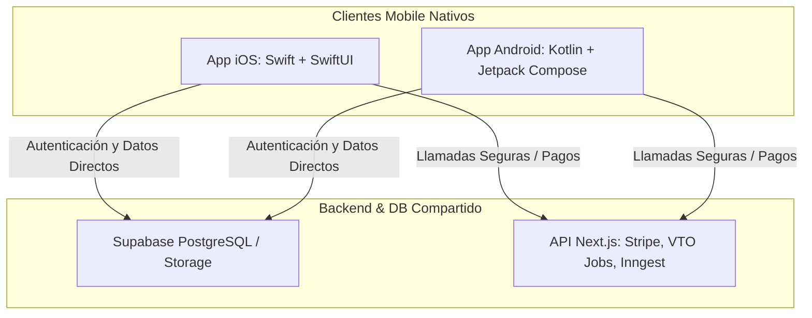

# 📱 Blueprint de Transición a Desarrollo Nativo: Looksy Mobile

Este documento establece la arquitectura técnica, herramientas recomendadas y mapa de ruta estratégica para migrar la aplicación móvil **Looksy** de Flutter a un desarrollo nativo en **Android (Kotlin)** e **iOS (Swift)**. 

---

## 1. Por qué la Transición a Nativo es el Camino Correcto

Aunque Flutter es excelente para el prototipado rápido y validación inicial de mercado, un producto enfocado al 99% en uso móvil que busca entregar una experiencia premium de moda requiere desarrollo nativo debido a:

*   **Rendimiento UX e Interfaz Fluida:** Las transiciones de pantalla, animaciones de fluidos (por ejemplo, al probarse ropa) y gestos táctiles complejos son 100% fluidos a 120Hz sin el "jank" inicial de compilación de shaders que a veces sufre Flutter.
*   **Integración de Hardware de Cámara y Sensores:** Mayor control sobre la captura de imágenes, previsualizaciones en tiempo real, corrección de color y uso de aceleradoras de IA locales (Apple Neural Engine / Android NNAPI) para análisis de estilo rápidos.
*   **Tamaño del Bundle y Tiempos de Carga:** Apps nativas significativamente más ligeras, lo que acelera la descarga de la tienda y mejora los ratios de conversión de instalación.
*   **Adopción de Características del SO:** Widgets de pantalla de inicio nativos, notificaciones interactivas enriquecidas, integración con Apple Watch / Android Wear y pagos fluidos con Apple Pay y Google Pay.

---

## 2. Arquitectura Tecnológica Propuesta

Para garantizar que el desarrollo nativo no duplique esfuerzos de backend, **compartiremos el 100% de la infraestructura de datos y lógica de servidor** que ya hemos construido para la web app.



### A. Stack Android Recomendado
*   **Lenguaje:** Kotlin
*   **UI Framework:** Jetpack Compose (Declarativo, moderno, análogo a React/Flutter)
*   **Arquitectura:** MVVM (Model-View-ViewModel) con Clean Architecture.
*   **Concurrencia:** Kotlin Coroutines & Flow (Para flujos de datos asíncronos y reactivos).
*   **Inyección de Dependencias:** Hilt (Soporte oficial de Google basado en Dagger) o Koin (Ligero y fácil de configurar).
*   **Cliente de Red:** Ktor Client o Retrofit para consumo de APIs Next.js.
*   **Integración Supabase:** SDK Oficial de Supabase para Kotlin (`supabase-kt`).

### B. Stack iOS Recomendado
*   **Lenguaje:** Swift 5.10+
*   **UI Framework:** SwiftUI (El estándar moderno de Apple para interfaces declarativas y animaciones).
*   **Arquitectura:** MVVM o TCA (The Composable Architecture) si el equipo de desarrollo crece.
*   **Concurrencia:** Swift Concurrency (async/await, Actors, Task Groups).
*   **Gestión de Dependencias:** Swift Package Manager (SPM) integrado directamente en Xcode.
*   **Integración Supabase:** SDK Oficial de Supabase para Swift (`supabase-swift`).

---

## 3. Estrategia de Autenticación Unificada

Supabase permite que múltiples clientes (Next.js, Flutter, Swift, Kotlin) compartan el mismo pool de usuarios sin fricción.

1.  **OAuth Nativo (Google & Apple):**
    *   En iOS, implementa el botón oficial *Sign in with Apple* y obtén el `identityToken`.
    *   En Android, utiliza *Google Credential Manager* para un inicio de sesión con un toque.
2.  **Vinculación con Supabase:**
    *   Envía los tokens de identidad recibidos de Apple/Google directamente al SDK de Supabase Auth usando `signInWithIdToken()`.
    *   Esto garantiza que los usuarios creados nativamente caigan en la misma tabla `auth.users` y activen de inmediato sus perfiles públicos en la tabla `User` de la base de datos PostgreSQL compartida.

---

## 4. Gestión de Archivos y Compresión en Cliente

Para mantener los costos de Supabase Storage en **$0/mes**, es vital evitar que los usuarios suban imágenes en resolución original de cámara (4K, ~5MB a 10MB por foto).

### Compresión Nativa en iOS (Swift)
```swift
func compressImage(image: UIImage) -> Data? {
    // Redimensionar la imagen a un tamaño razonable para análisis de moda (ej. max 1200px)
    let targetSize = CGSize(width: 1200, height: 1200)
    let resizedImage = image.resized(to: targetSize)
    
    // Comprimir al 70% de calidad JPEG para conservar detalle de texturas con un peso de <300KB
    return resizedImage.jpegData(compressionQuality: 0.7)
}
```

### Compresión Nativa en Android (Kotlin)
```kotlin
fun compressBitmap(bitmap: Bitmap): ByteArray {
    val outputStream = ByteArrayOutputStream()
    // Redimensionar conservando aspect ratio antes de comprimir
    val resizedBitmap = Bitmap.createScaledBitmap(bitmap, 1200, 1200, true)
    
    // Comprimir al 70% de calidad JPEG
    resizedBitmap.compress(Bitmap.CompressFormat.JPEG, 70, outputStream)
    return outputStream.toByteArray()
}
```

---

## 5. Herramientas Clave para Estabilidad y Lanzamiento Exitoso

Para lograr un lanzamiento "completo" y estable sin requerir modificaciones constantes después de publicar en las tiendas, integra estas herramientas desde el día uno:

### A. Monitoreo de Errores y Diagnóstico
*   **Firebase Crashlytics:** Herramienta indispensable y gratuita para recolectar reportes de fallos en tiempo real. Clasifica los errores por prioridad y muestra en qué línea exacta del código nativo ocurrió el error.
*   **Sentry:** Alternativa premium con mapas de calor y rastreo de performance de consultas de red.

### B. Monetización Integrada y Suscripciones (Freemium)
*   **RevenueCat SDK:** Conectar directamente StoreKit (Apple) y Google Play Billing puede ser una pesadilla técnica y propensa a fallos de sincronización de base de datos.
    *   **RevenueCat** unifica ambas pasarelas bajo una única API gratuita para los primeros $10k/mes de facturación.
    *   Permite cambiar precios, activar promociones y verificar recibos de pago en el servidor sin tener que lanzar actualizaciones a las tiendas.
    *   Se conecta directamente con Supabase mediante Webhooks para actualizar la tabla `Subscription` del usuario.

### C. Despliegue Continuo (CI/CD)
*   **Fastlane:** Automatiza el incremento de números de compilación, la firma de código con certificados (que en iOS suele fallar) y sube la app automáticamente a:
    *   **TestFlight** en iOS para pruebas cerradas inmediatas.
    *   **Google Play Console (Internal/Beta Track)** en Android.
*   Te permite lanzar parches urgentes o nuevas versiones con un solo comando en terminal (`fastlane deploy`).

### D. Optimización de IA en el Cliente (Futuro)
*   **Google AI Edge SDK (Gemini Nano):** Con la llegada de Gemini Nano en Android y Apple Intelligence en iOS, los análisis de estilos sencillos e identificación de colores se podrán correr **localmente en el dispositivo** sin consumir internet ni generar costos de API key de Gemini Cloud.

---

## 6. Mapa de Ruta de Desarrollo Recomendado

Para migrar ordenadamente de Flutter a Nativo sin detener el negocio:

```
[Fase 1: Completar Flutter] ---> [Fase 2: Lanzar Flutter Beta] ---> [Fase 3: Paralelizar Nativo] ---> [Fase 4: Migración y Apagado Flutter]
```

1.  **Fase 1: Estabilización de Flutter (Actual):** Completar las funciones de interacción social y perfil real.
2.  **Fase 2: Validación de Mercado (MVP en Tiendas):** Lanzar la versión Flutter a producción. Sirve para captar los primeros miles de usuarios activos y validar si el mercado responde bien a Looksy.
3.  **Fase 3: Desarrollo Nativo Paralelo:** Mientras Flutter opera y genera ingresos de afiliados, se desarrollan las apps nativas en Kotlin/Swift conectadas al mismo backend.
4.  **Fase 4: Lanzamiento e Intercambio:** Publicar las versiones nativas como actualizaciones de la app existente en Google Play y App Store. Los usuarios ni notarán el cambio, excepto por una app que de repente carga el doble de rápido y se siente 100% premium.
